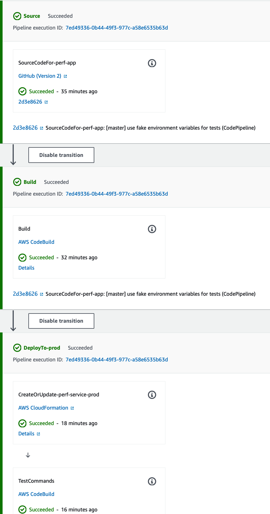

# perf-service
performance library gateway to store ttfb, fcp, dom load and window load events as well as network timings for document, image, font, js and css that is being collected using perf-lib

# links
See [changelog](./CHANGELOG.md) for current versions and feature plans.

# api gateway
'/report' route is used to handle saving of single web-vitals metrics as well as resource metrics and device data
'/reportMany' route is used to handle saving of bulk web-vitals metrics as well as resource metrics and device data 

The 2 packages used here :
1. express.js is being used to handle http requests and responses
2. mongoose.js is being used to store data into MongoDB Atlas

# usage
A docker image is created and then it is deployed to AWS App Runner using AWS Copilot CLI
If you want to start testing the server on your local machine, you need to open a MongoDb Atlas account and set the information below into .env file:
> touch .env
- PORT=8080
- DATABASE_URL=mongodb.url
- DATABASE_USER=mongodb.user
- DATABASE_PASS=mongodb.pass
- DATABASE_NAME=mongodb.name

Then to test the services on local machine:
> npm run start

# development packages
eslint, prettier is used for clean-code.
husky is used to push only the clean-code into git.
typescript and ts-node-dev is used to support typescript.
forever is being used to run the service always

# commands
- "start": starts a server on local using ts-node-dev
- "lint": run eslint
- "lint:fix": run eslint with autofix
- "test": run tests

# testing
You can run the tests by running the command:
> npm run test

Jest is being used for testing the whole library.

# deployment - AWS
The services are deployed to AWS App Runner. You can of course use another provider that supports Docker images to deploy the services.
To deploy the services to AWS App Runner using a docker image, [AWS Copilot CLI](https://github.com/aws/copilot-cli) is used.
- To install AWS Copilot CLI on MacOS, run
> brew install aws/tap/copilot-cli

- !BE SURE THAT YOU ARE NOT USING YOUR ROOT ACCOUNT WHILE USING COPILOT CLI
- Please see the [documentation](https://github.com/aws/copilot-cli/blob/mainline/site/content/docs/credentials.en.md)
- Please create a new IAM admin user by following the tutorial [here](https://docs.aws.amazon.com/IAM/latest/UserGuide/getting-started_create-admin-group.html)
- Please create a named profile using AWS cli as described [here](https://docs.aws.amazon.com/cli/latest/userguide/cli-configure-profiles.html)

- Run aws configure with a new profile name :
> aws configure --profile <profilename>
- Enter your credentials of your new admin user
- Set default aws profile as <profilename>
> export AWS_PROFILE=<profilename>

- Steps to deploy service :
> copilot init
- Give your app a name      -> (perf-app)
- Select a workload type    -> (Request-Driven Web Service)
- Give your service a name  -> (perf-service)
- Select dockerfile         -> ./Dockerfile
- Create a test env         -> N
> copilot env init
- Give this environment a name  -> prod
- Select credential to use      -> <profilename>
- Use default configurations
> copilot svc deploy

- After you deploy the service, App Runner will give you an url to access your service
- If you would like to use a custom domain name for this service, you need to have a domain name from a registrar
- You need to open page AWS Console->Services->Route 53 then navigate to "Hosted Zones"
- Then you need to press "Create hosted zone" 
- You need to enter your domain name and leave other options as it is "Public Hosted Zone"
- After AWS created NS records for your domain, you need to copy them
- You need to navigate your domain name registrar's page and update NS records there with the ones that you have copied (you may need to remove transfer-lock if needed)
- Then you need to navigate AWS Console->Services->AWS App Runner and click on your service name
- Then from the opened page, you need to select "Custom domains" tab and click on "Add domain" button
- You need to set your domain name from here, and AWS will give you some CNAME values for SSL verification and domain name redirection
- You need to again open page AWS Console->Services->Route 53 then navigate to "Hosted Zones" and select the "hosted zone" that you have created
- Then you need to enter the 3 CNAME values as a new record as expected
- After TTL time passes (like 5 mins), you can access your services via your custom domain name

# CI/CD pipeline - AWS
The CI/CD pipeline is created for the project using Copilot CLI which uses [AWS CodePipeline](https://aws.amazon.com/blogs/containers/enabling-continuous-workflows-for-aws-app-runner-service-with-persistency-using-aws-copilot-cli/).
- In order to create the CI/CD pipeline, run command
> copilot pipeline init
- Then select the environment (prod) and select the git repository url which will create a buildspec.yml and pipeline.yml files under copilot folder
- Update pipeline.yml file, source->properties->branch to which branch that CI/CD pipeline will work (master in our case)
- Update pipeline.yml file, add your test commands under stages->test_commands
- Then push these changes to git repository
- After pushing these changes, run command
> copilot pipeline update
- This command will give you an [url](https://console.aws.amazon.com/codesuite/settings/connections), navigate to it and click on your pipeline
- Then press "Update pending connection" and press "Install a new app"
- Continue with the steps which will take you to github login page, login with your user and then select your user from the textbox and press "Connect"
- After this you will be ready to go
- After every commit&push to your master branch AWS CodePipeline will fetch the last commit, build the code, run your test command
- If it is successfull then it will publish new Docker image to your AWS App Runner

