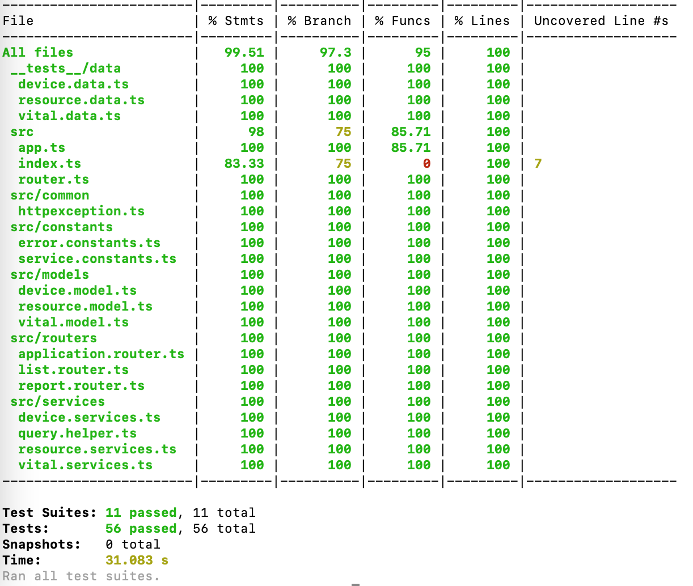

# perf-service
performance library gateway to store ttfb, fcp, dom load and window load events as well as network timings for document, image, font, js and css that is being collected using perf-lib

# links
See [changelog](./CHANGELOG.md) for current versions and feature plans.

# api gateway
Only '/report' route is being used to handle saving of web-vitals metrics as well as resource metrics and device data

The 2 packages used here :
1. express.js is being used to handle http requests and responses
2. mongoose.js is being used to store data into MongoDB Atlas

# usage
I will create a docker image and then publish that image to Amazon ECR
For local testing:
> npm run start

# known issues
Forever script will be added with docker image then the image will run on ECS using the published image on ECR

# development packages
eslint, prettier is used for clean-code.
husky is used to push only the clean-code into git.
typescript and ts-node-dev is used to support typescript.

# commands
- "start": starts a server on local using ts-node-dev
- "lint": run eslint
- "lint:fix": run eslint with autofix
- "test": run tests

# testing
You can run the tests by running the command:
> npm run test

Jest is being used for testing the whole library.

# todo
add docker image and forever package for deployment to Amazon